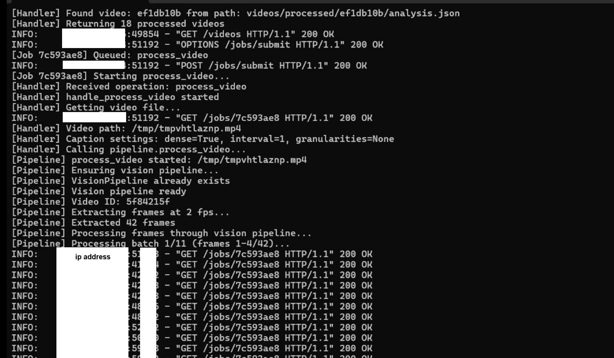

# Spatio-Temporal Perception Engine (STPE)

**For Generating Self-Supervised Training Datasets for Spatio-Temporal Foundation Models**

A focused two-week research initiative investigating video understanding, object tracking, and ground-truth state extraction to support the training of next-generation AI models.
(~25 hours of total research and development effort over two weeks)

---

## Overview

The Spatio-Temporal Perception Engine (STPE) is designed as a foundational perception layer, not a reasoning AI model.

Its purpose is to enable self-supervised training data generation by extracting structured, persistent information from raw video - preserving space and time before higher-level models ever see the data. (3D continuity is a goal but not yet implemented in this version.)

> **Research Status**: This project is exploratory research infrastructure, not a formal research paper. It lacks quantitative benchmarks and ablation studies due to compute/budget/time constraints. The pipeline is functional and designed to be adopted by researchers with resources to conduct proper evaluations. If you're interested in collaborating or using this for formal research, [get in touch](https://superbullet.ai/contact).

---

## Video Examples

| Type | Description | Preview | Processed Output |
|------|-------------|---------|------------------|
| Video Game | FPS game with object tracking | [Watch](https://youtu.be/WPfktFT9-6o) | [Download](processed_examples/game_processed_video.zip) |
| Real World | Column and ruins scene | [Watch](https://youtu.be/oH7ap1xFiTc) | [Download](processed_examples/real_world_processed_video.zip) |
| Roblox Jumping | Character jump with ground-truth physics state (60 FPS) | [Watch](https://youtu.be/AmcG5SgwYhY) | [Download](processed_examples/roblox_jumping_processed_video.zip) |
| Roblox Walking | Character locomotion with velocity vectors (10 FPS) | [Watch](https://youtu.be/uN9lFyck9_w) | [Download](processed_examples/roblox_walking_processed_video.zip) |

---


*Example: RunPod backend processing a video via SSH terminal*

### Why This Exists

I'm the creator, sole founder, and programmer of [SuperbulletAI](https://superbullet.ai) - a Roblox AI game builder. Roblox is a 3D world, and through massive iterations and attempts building AI for it, I've seen firsthand the limitations of current approaches.

Before this research, I had been investigating why OpenAI and Anthropic still did not have a way to properly process videos. Then I heard about [General Intuition's](https://x.com/robopapers/status/1988970114151051445) mission, and after deep research, I understood why. After 2 weeks of 24/7 digging, this is what I came up with.

The issue is not a lack of scale or compute, but the absence of a dedicated spatio-temporal perception layer.

Most frontier AI models as of 2025 (ChatGPT, Claude, etc.) don't even properly consume video as sequences of frames or compressed tokens. Only Gemini 3 Pro does this right now, and it's still not perfect. This collapses spatial structure, breaks object identity across time, and removes causal continuity - resulting in significant context loss at the data level that frontier AI models could reason better if they had access to.

STPE addresses this by operating **prior to model training**, transforming raw sensory input into structured spatio-temporal representations suitable for large-scale self-supervised learning.

Think of STPE as layer 1 - it doesn't "think," but processes raw video into structured data that a spatio-temporal foundation model could use when creating its training datasets, therefore being able to think!

### Implementation

The system combines SOTA models as of December 2025 (DINOv3, SAM 3, Qwen3-VL) to extract hierarchical spatio-temporal features with frame-by-frame accuracy.

### Core Pipeline

```
Video Input
    │
    ├─► Frame Extraction (configurable FPS)
    │
    ├─► 3-Level Vision Processing
    │   ├─► Level 1: Global Scene Embeddings (4096-dim)
    │   ├─► Level 2: Object Detection & Segmentation
    │   └─► Level 3: Dense Spatial Feature Maps
    │
    ├─► Temporal Analysis
    │   ├─► Object Tracking Across Frames
    │   ├─► Motion Feature Extraction
    │   └─► Scene Graph Construction
    │
    └─► Output: Structured Training Dataset
        ├─► Per-frame embeddings
        ├─► Object trajectories
        ├─► Dense captions
        └─► Game state metadata (optional)
```

---

## Model Stack

| Model | Role | Output |
|-------|------|--------|
| **DINOv3-7B** | Vision backbone, scene understanding | 4096-dim embeddings |
| **SAM 3** | Instance segmentation, object detection | Masks, bounding boxes, labels |
| **Qwen3-VL** | Vision-language captioning | Dense frame descriptions |

**Hardware**: Uses ~40 GB VRAM base, but temporary caching will utilize the rest. H100 SXM or A100 80GB recommended.

**Development Cost**: Proud to say this entire project was built for approximately **$65 USD** in RunPod GPU credits 🎉

---

## Roblox Training Datasets

Training datasets from Roblox are matched precisely based on:
- **FPS synchronization** between video and game state logs
- **Timestamp alignment** with sub-50ms accuracy
- **Frame-by-frame correspondence** using Python + Roblox Luau scripts

### Sample Datasets (Raw Frames + Game State Metadata)

- [jump_stationary_extracted_frames.zip](https://pub-c3287398ac4c45169f66c4600540de91.r2.dev/roblox_datasets/jump_stationary_extracted_frames.zip)
- [walk_and_stop_extracted_frames.zip](https://pub-c3287398ac4c45169f66c4600540de91.r2.dev/roblox_datasets/walk_and_stop_extracted_frames.zip)

These contain non-processed frames with ground-truth game state metadata per frame.

### Game State Metadata Structure

Each frame includes ground-truth data from `HumanoidRootPart` (Roblox calculates physics for 1 part, animations are visual):

```json
{
  "frame": 1,
  "timestamp": 1765616658.5261,
  "fps": 57.0,
  "humanoid_state": "Running",
  "hrp": {
    "position": [x, y, z],
    "velocity": [vx, vy, vz],
    "speed": 16.0
  },
  "ground": {
    "landing_point": [x, y, z],
    "distance_to_landing": 0.0
  },
  "camera": {
    "position": [x, y, z],
    "distance_to_hrp": 12.66
  },
  "inputs": ["W", "D"]
}
```

For integration details, consult me directly.

---

## Setup

### Prerequisites

1. **Hugging Face Access**: Request access to DINOv3 and SAM 3 models (at the time of this writing, these models require approval)
2. **RunPod Account**: Create a GPU pod (H100 SXM or A100 80GB) with **port 8000 exposed** for backend communication

### Installation

```bash
# 1. Clone repository in RunPod workspace
cd /workspace
git clone https://github.com/Froredion/Spatio-Temporal-Perception-Engine
cd Spatio-Temporal-Perception-Engine

# 2. Configure Hugging Face token
echo "your_huggingface_token" > /workspace/.hf_token

# 3. Setup environment variables
cp runpod_backend/.env.example runpod_backend/.env
# Edit .env with your R2 storage credentials

# 4. Make scripts executable
chmod +x runpod_backend/start.sh
chmod +x runpod_backend/.env

# 5. Launch
./runpod_backend/start.sh

# 6. Setup the R2 Storage Setup (instructions below)

# 7. Setup Frontend Application (instructions below)
```

#### R2 Storage Setup

First, create your own [Cloudflare R2](https://www.cloudflare.com/products/r2/) bucket. Then set up CORS to enable frontend functionality:

```json
[
  {
    "AllowedOrigins": [
      "http://localhost:5000"
    ],
    "AllowedMethods": [
      "GET",
      "HEAD"
    ],
    "AllowedHeaders": [
      "*"
    ],
    "MaxAgeSeconds": 3600
  }
]
```

#### Frontend Setup

The frontend is a React + TypeScript application for uploading videos and viewing analysis results. (Semantic search is planned but not yet available.)

```bash
cd frontend
npm install

# Edit frontend/src/config.ts to set your RunPod backend URL

npm run dev
```

This starts the development server at `http://localhost:5000`.

**Known Limitations:**
- File upload functionality for non-image files is not battle-tested and may not work reliably
- You may experience issues uploading files directly - using URLs tends to work more reliably

---

## Limitations

### Performance
- **1 H100 SXM GPU**: Requires approximately 5-7 minutes to process a 40-second video
- Processing speed: ~2 fps for full pipeline (all 3 levels + temporal analysis)
- **Not optimized for scale**: Limited to 1 GPU - unable to scale for faster processing. There may be ways to optimize further, but given this was a 2-week project, this was not prioritized. Goal for future iterations: process 1 minute of video in 1 second.
- **Frame size matters**: Reducing frame resolution significantly speeds up processing
- **Optimizer support**: The frame optimizer currently only works with SAM 3 and DINOv3. Qwen3-VL still processes at original frame proportions (e.g., 1920x1080). Adding optimizer support for Qwen3-VL would significantly reduce its processing time.

### Technical Debt
- This is my first ML project. The codebase is not optimized for readability or cleanliness.
- **No Docker**: Uses `start.sh` shell script for RunPod deployment. A Dockerfile would provide reproducible environments and faster cold starts.
- Running pip as root user can cause permission conflicts. Recommendation from pip:
  > *"It is recommended to use a virtual environment instead."*

### Captioning Quality
- **Human-provided context significantly improves accuracy**: The caption model performs much better when given human-provided context describing what the video is about. For example, the Roblox walking video was incorrectly captioned as "dancing" when it's actually a character walking. Providing human context like "this is a Roblox character walking" combined with the N-1 frame's game state metadata would dramatically improve captioning accuracy.
- See [Motion Analysis Improvements](MOTION_ANALYSIS_IMPROVEMENTS.md) for how temporal context (N-1 frame metadata) enables the model to reason about state transitions and produce richer captions.
- For stronger captioning, use a frontier vision model
- **Recommended**: Gemini 3 Pro (SOTA vision benchmarks as of December 2025)
- **Potential research direction**: A two-stage pipeline using Gemini 3 Pro for initial visual analysis, followed by GPT-5.2 (SOTA mathematical reasoning benchmarks) to refine outputs using ground-truth game state metadata. The hypothesis is that structured numerical data (velocity vectors, positions, physics states) can constrain and correct vision model outputs. Requires empirical validation - run your own evals.

### Detection Categories
- SAM 3 data categories could be improved by adding more data categories for better AI model detection
- I suggest training SAM 3 based on your specific needs - multiple iterations will improve results
- Custom category mapping may be needed for game-specific objects

### Missing Components
- **No world model used**. V-JEPA 2 is currently SOTA based on my research. Adding it to this pipeline would likely improve results significantly.

### Notes
- See [Motion Analysis Improvements](MOTION_ANALYSIS_IMPROVEMENTS.md) for ideas on enhancing motion analysis

---

## Findings & Conclusions

### The Noise Problem

There's too much noise in extracted features. I was only able to reliably track what's happening between similar objects in consecutive frames.

### What's Actually Needed

For accurate spatio-temporal understanding, these elements are critical:

1. **Camera CFrame** - Exact camera position and orientation
   - In Roblox: Available directly via `Camera.CFrame` and `Camera.ViewportSize`
   - In real world: Cannot be reliably tracked directly. Requires estimation through:
     - **Physical camera sensor size** - The actual dimensions of the camera sensor
     - **Focal length estimation** - Derived from lens properties or estimated via CV
     - **Camera pixel resolution** - Output image dimensions
     - **3D depth estimation** - Monocular or stereo depth models
     - **Camera pose estimation** - Position and orientation in world space
   - Combining additional AI models for depth/pose estimation could be a future upgrade for this perception engine
2. **Camera vs Object Motion Detection** - Reliably distinguish whether the camera is moving or the object is moving (or both)
   - In Roblox: Easily tracked because we literally know when the camera moves
   - In real world: Requires AI + math to solve this ambiguity
3. **Camera-to-Object Distance** - Accurate depth information
4. **Ground-Truth State** - Not estimated, but measured

### Why Game Engines Are Superior

Game engines like Roblox can generate the most accurate datasets for self-supervised training. Real-world video lacks ground-truth state.

**The insight**: Foundation training datasets should be trained **solely with simulation first**. Real-world training datasets should be **secondary**. This produces structural improvements that scaling alone cannot achieve.

**Hypothesis** (requires validation): Simulation-first training may yield significant data efficiency gains due to perfect ground-truth labels eliminating label noise. Proper benchmarking against real-world-only baselines is needed to quantify this.

### Beyond Game Engines

For scenarios requiring 100% accurate states outside standard game physics:

1. **Hand State Foundation**
   - 5-finger tracking animated via Blender
   - State tracking across different hand types
   - Paired with real-world examples

2. **Hand-Object Interaction**
   - Blender-based simulation
   - Ground-truth contact and manipulation states

### Limitations of Game Engines

Even Roblox has gaps:
- **Deformable & Material-Aware Dynamics**: Roblox excels at rigid bodies, but reality includes deformation states (bend, stretch, compress)
- However, even these can be simulated with proper setup

---

## Credits

- **[Replit](https://replit.com)** - Frontend initial design prototype
- **[DINOv3](https://github.com/facebookresearch/dinov3)** - Vision backbone (Meta AI)
- **[SAM 3](https://github.com/facebookresearch/sam3)** - Instance segmentation (Meta AI)
- **[Qwen3-VL](https://github.com/QwenLM/Qwen3-VL)** - Vision-language model (Alibaba)

---

## Contact

**SuperbulletAI** can help generate optimal training datasets for your foundation model using Roblox, including better captioning with ground-truth state.

We can create custom plugins for your specific use case, or I might open-source it in the future.

I am the sole founder of the first and most powerful Roblox AI Game Builder.

**[superbullet.ai/contact](https://superbullet.ai/contact)**

---

## MIT License

See [LICENSE](LICENSE)
